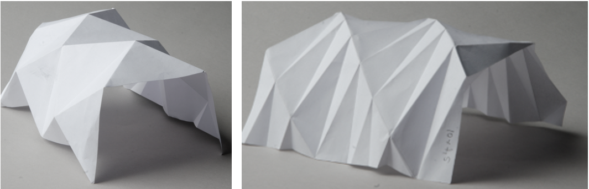
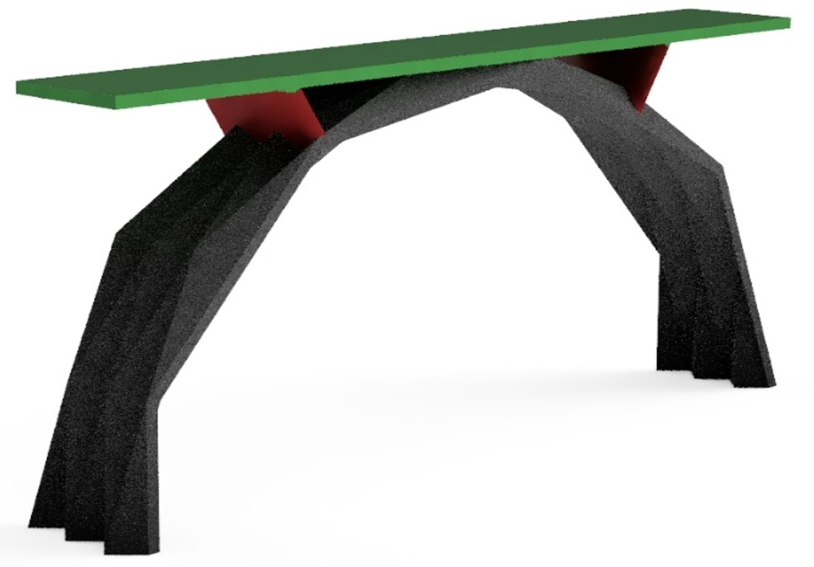
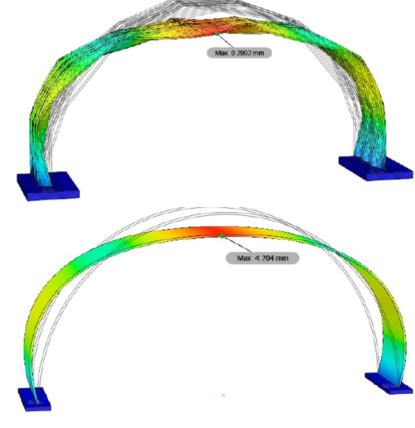
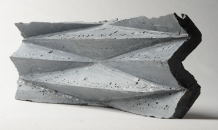
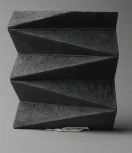

# Masters
_2019_

I created an origami-inspired concrete bridge model which I took to an International competition of bridges.

The whole process was done from scratch. First, initial design was elaborated:

Until final shape of the bridge was found. The Circular arch is created from repeated pattern of triangles.

The work then focused on the strength the origami shape provides to it. In the picture below, you can see a difference in deflection for two bridges of the same weight, one with origami-like folds and the other flat. The deflection of the bridge with folds turned out to be 7x smaller.

The building process was tested on small scale models until everything was working well.

At last the final model was created.

