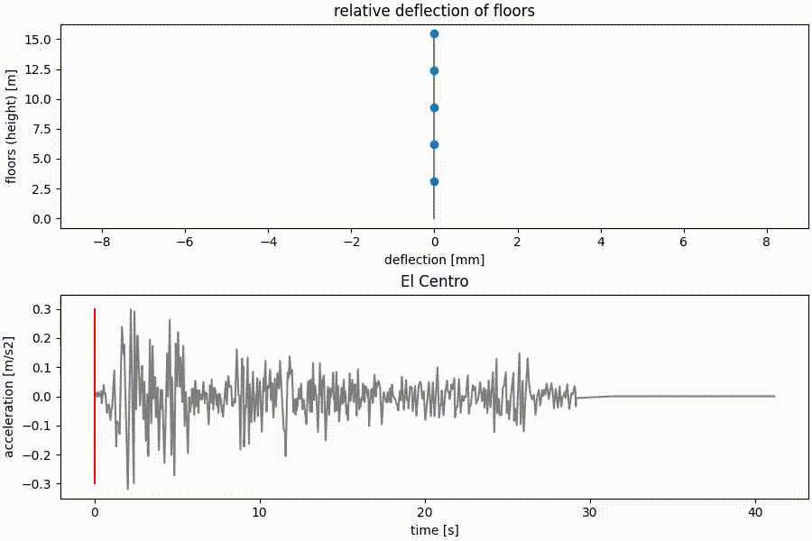

## Dynamics - Response of basic structure to earthquake
This project takes a very simple building of 5 floors and applies on it the famous El Centro earthquake of magnitude 6.9 from the year 1940. The response of the building was calculated and stability of the numerical calculation was tested. You can see the code [here](./dynamicsCode.md).

 

## Heat Transfer - Temperature in a wall over time
In this school project I created code in Python to simulate what happens inside wall during a regular day. This could be used to simulate the need for heating inside the building.

The code uses the numerical solution of heat equation using the finite difference method.

For more see this [pdf in Czech](./assets/heat%20-%20finite%20difference.pdf)

[Go back](index.md)
